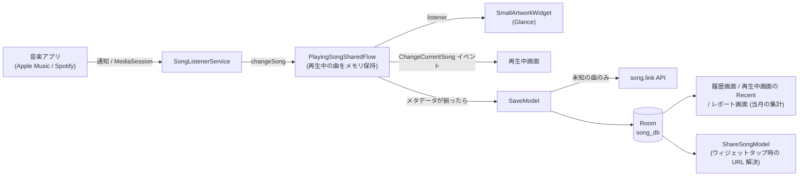

# Sumire 実装ドキュメント

Sumire の実装を把握するためのドキュメント集。ユーザー向けの説明はリポジトリ直下の [README.ja.md](../README.ja.md) を参照。

記載内容は `develop` ブランチ (レポートタブ追加の SnowDango/sumire#341 まで。`versionName 0.0.5` / Room DB `version 3`) のコードに基づく。コードを変更したら、関係するドキュメントも合わせて更新すること。

## 目次

| ドキュメント | 内容 |
| --- | --- |
| [architecture.md](architecture.md) | モジュール構成・依存関係・レイヤーの責務・DI (Koin)・コルーチンスコープ |
| [playback-detection.md](playback-detection.md) | 通知リスナーによる再生検知と、再生中の曲の状態管理 (`PlayingSongSharedFlow`) |
| [persistence.md](persistence.md) | 履歴の保存フロー、song.link API、Room の DB スキーマ、DataStore の設定値 |
| [screens.md](screens.md) | アプリ本体の画面 (起動・権限ダイアログ・再生中・履歴・レポート・設定) と共通 UI |
| [widget.md](widget.md) | Glance ウィジェット、WorkManager、タップ時の共有処理 |
| [build-and-ci.md](build-and-ci.md) | ビルド設定・署名・静的解析・テスト・CI/CD・リリース手順 |
| [development-guide.md](development-guide.md) | コーディング規約、よくある変更の手順、実装上の注意点と既知の課題 |

## 全体像

1. `SongListenerService` (`NotificationListenerService`) が音楽アプリの通知を受け取り、`MediaSessionManager` から再生中のメタデータを取り出す。
2. `PlayingSongSharedFlow` がメモリ上に「今再生中の曲」を保持し、変化があれば画面とウィジェットに通知する。
3. 曲のメタデータが揃ったら `SaveModel` が song.link API で各サービスの URL を取得し、Room に履歴として保存する。
4. 画面 (Jetpack Compose) は Room の履歴を Paging / Flow で表示し、レポートタブでは当月の再生回数やランキングを集計して表示する。ウィジェット (Glance) は再生中の曲を表示し、タップで URL のコピーまたは X への共有を行う。

## 用語

| 用語 | 意味 |
| --- | --- |
| mediaId | 再生元アプリが `MediaMetadata.METADATA_KEY_MEDIA_ID` で返す曲 ID。返さないアプリでは `"<platform>:<title>:<artist>:<album>"` を代わりに使う。DB 上は `AppSongKey.mediaKey` に入る |
| queueId | 「今どの曲を再生しているか」を見分けるための ID。曲の切り替わり判定だけに使い、DB には保存しない ([playback-detection.md](playback-detection.md#queueid-の決め方)) |
| platform | song.link API の `linksByPlatform` のキー (`appleMusic`, `spotify` など)。`MusicApp.platform` / `UrlPriorityPlatform.platform` と同じ文字列にしてある |
| apiProvider | song.link API の `entitiesByUniqueId[].apiProvider` の値 (`itunes`, `spotify` など)。`MusicApp.apiProvider` と同じ文字列にしてある |
| infla | インフラ層のモジュール名。綴りは `infla` のまま運用している |
| VRT | Visual Regression Test。`@PreviewTest` を付けた Preview を Compose Preview Screenshot Testing で撮影し、PR 先ブランチの画像と比較する ([build-and-ci.md](build-and-ci.md#vrt-の仕組み)) |
