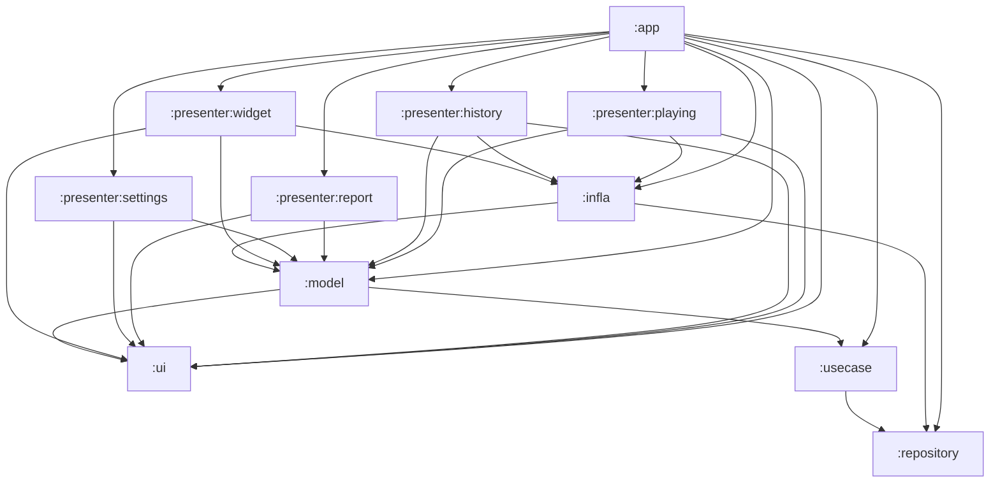

# アーキテクチャ

## 技術スタック

バージョンはすべて [`gradle/libs.versions.toml`](../gradle/libs.versions.toml) で管理している。

| 分類 | 採用技術 | バージョン |
| --- | --- | --- |
| 言語 / ビルド | Kotlin, AGP, Gradle Wrapper, KSP (Room のコード生成のみ), JDK | Kotlin 2.3.21 / AGP 9.2.1 / Gradle 9.4.1 / KSP 2.3.8 / JDK 21 |
| SDK | minSdk / compileSdk / targetSdk | 33 (Android 13) / 36 / 36 |
| UI | Jetpack Compose (Material 3), Navigation Compose, material-kolor | Compose BOM 2026.03.00 / Navigation 2.9.6 |
| ウィジェット | Jetpack Glance, WorkManager | Glance 1.1.1 / WorkManager 2.11.1 |
| DI | Koin | 4.2.1 |
| 非同期 | Kotlin Coroutines / Flow | 1.10.2 |
| DB | Room (+ Paging) | Room 2.8.4 / Paging 3.3.6 |
| 設定 | DataStore Preferences | 1.2.0 |
| 通信 | Ktor Client (Android engine) + kotlinx.serialization | Ktor 3.5.0 |
| 画像 | Coil (URL のサムネイル表示) | 2.7.0 |
| 設定画面 UI | compose-settings (alorma) | 3.1.0 |
| 計測 | Firebase Analytics / Crashlytics | Firebase BOM 34.13.0 |
| VRT | Compose Preview Screenshot Testing (`com.android.compose.screenshot`) | 0.0.1-alpha16 |
| 静的解析 | detekt (+ formatting, compose rules), Android Lint | detekt 1.23.8 |

## モジュール構成

[`settings.gradle.kts`](../settings.gradle.kts) で 12 モジュールを include している。

| モジュール | 役割 | Android namespace | Kotlin パッケージ |
| --- | --- | --- | --- |
| `:app` | Application / Activity / 通知リスナーサービス / ウィジェットの Receiver。Koin の起動と画面遷移 | `com.snowdango.sumire` | `com.snowdango.sumire` |
| `:presenter:playing` | 再生中画面 (Compose + ViewModel) | `com.snowdango.sumire.presenter.playing` | `com.snowdango.sumire.presenter.playing` |
| `:presenter:history` | 履歴画面 (Compose + ViewModel + Paging) | `com.snowdango.sumire.presenter.history` | `com.snowdango.presenter.history` ※ |
| `:presenter:report` | レポート画面 (当月の再生集計。Compose + ViewModel) | `com.snowdango.sumire.presenter.report` | `com.snowdango.sumire.presenter.report` |
| `:presenter:settings` | 設定画面 (Compose + ViewModel) | `com.snowdango.sumire.presenter.settings` | `com.snowdango.sumire.settings` ※ |
| `:presenter:widget` | Glance ウィジェット本体・Worker・タップ時のアクション | `com.snowdango.sumire.presenter.widget` | `com.snowdango.sumire.widget` ※ |
| `:ui` | 共通 Compose コンポーネント、テーマ (Compose / Glance)、表示用データ (`SongCardViewData`, `MonthlyReportViewData` など)、アプリアイコン等のリソース | `com.snowdango.sumire.ui` | `com.snowdango.sumire.ui` |
| `:model` | 画面やインフラから呼ばれるビジネスロジック (保存・取得・共有 URL 解決・設定) | `com.snowdango.sumire.model` | `com.snowdango.sumire.model` |
| `:usecase` | DB / API / DataStore への細かい操作を 1 クラス 1 テーブル程度の粒度で包む | `com.snowdango.sumire.usecase` | `com.snowdango.sumire.usecase` |
| `:repository` | Room の Database と DAO、Ktor による song.link API クライアント | `com.snowdango.sumire.repository` | `com.snowdango.sumire.repository` |
| `:data` | エンティティ・API レスポンス・enum・拡張関数 (他モジュールに依存しない) | `com.snowdango.sumire.data` | `com.snowdango.sumire.data` |
| `:infla` | 再生中の曲の保持 (`PlayingSongSharedFlow`)、アプリ内イベントバス (`EventSharedFlow`)、Analytics 送信 (`LogEvent`) | `com.snowdango.sumire.infla` | `com.snowdango.sumire.infla` |

※ namespace とパッケージ名が一致していないモジュールがある。`R` と `BuildConfig` は namespace 側に生成されるため、たとえば設定画面では `com.snowdango.sumire.presenter.settings.R` / `BuildConfig` を import している。新しいファイルを置くときは既存ファイルと同じパッケージに揃えること。

## モジュール依存関係

各モジュールの `build.gradle.kts` の `implementation(project(...))` をそのまま図にしたもの。`:data` にはほぼ全モジュールが依存しているため、`:data` への矢印は省略している。



押さえておくべき点:

- すべて `implementation` 依存なので推移的には見えない。`:app` が `SongLinkApi` や `SongsDatabase` を直接触るのは、`:app` が `:repository` を直接依存に持っているから。
- `:model` が `:ui` に依存している。`GetHistoriesModel` / `GetReportModel` が Room の結果を表示用の `SongCardViewData` / `MonthlyReportViewData` (`:ui` 所属) に変換するため。
- `:infla` が `:model` に依存している。`PlayingSongSharedFlow` が曲の確定時に `SaveModel.saveSong()` を呼ぶため。

## レイヤーと責務

```
Presenter (Compose 画面 / ViewModel / Glance)
   ↓
Model      (SaveModel, GetHistoriesModel, GetSongsModel, GetReportModel, ShareSongModel, SettingsModel)
   ↓
UseCase    (SongsUseCase, HistoriesUseCase, AppSongKeyUseCase, ... , SongLinkApiUseCase, SettingsUseCase)
   ↓
Repository (SongsDatabase + DAO, SongLinkApi + KtorClient)
   ↓
Data       (Room エンティティ, API モデル, enum, 拡張関数)

Infla は横断的な位置付け: Service / Presenter から使われ、Model を呼ぶ
```

| レイヤー | ルール |
| --- | --- |
| Presenter | ViewModel は Model だけを呼ぶ。UseCase や DAO を直接呼ばない |
| Model | 複数の UseCase を組み合わせた処理を書く。スレッド切り替え (`withContext(Dispatchers.IO)`) もここで行う |
| UseCase | DAO や API を薄く包むだけ。見つからないときの `-1` 返却など、呼び出し側が扱いやすい形に整える程度 |
| Repository | Room の `@Dao` と Ktor の呼び出し。HTTP ステータスを `SongLinkResponse.Status` に変換する |
| Data | 依存なしの純粋なデータ定義。Room / kotlinx.serialization のアノテーションだけ持つ |

## DI (Koin)

Koin は [`SumireApp.onCreate()`](../app/src/main/java/com/snowdango/sumire/SumireApp.kt) で起動する。`GlobalContext.getOrNull() ?: startKoin { ... }` として、すでに Koin が起動していれば二重に起動しないようにしている。

| Koin モジュール | 定義場所 | 中身 |
| --- | --- | --- |
| `sharedModule` | `SumireApp` (private) | `single`: `SongLinkApi`, `SongsDatabase`, `EventSharedFlow`, `PlayingSongSharedFlow`, `DataStore<Preferences>` (ファイル名 `settings`), `CoroutineScope` (アプリスコープ) / `factory`: `LogEvent` |
| `mainModule` | `SumireApp` (private) | `viewModel`: `MainViewModel` |
| `playingKoinModule` | `:presenter:playing` | `viewModel`: `PlayingViewModel(get(), get())` |
| `historyKoinModule` | `:presenter:history` | `viewModel`: `HistoryViewModel` |
| `reportKoinModule` | `:presenter:report` | `viewModel`: `ReportViewModel` |
| `settingsModule` | `:presenter:settings` | `viewModel`: `SettingsViewModel` |
| `widgetModule` | `:presenter:widget` | `single`: `WidgetViewModel(get())`, `SmallArtworkWidget` |
| `modelModule` | `:model` | `factory`: 全 Model クラス |
| `useCaseModule` | `:usecase` | `factory`: 全 UseCase クラス (`SettingsUseCase` だけ DataStore をコンストラクタで受け取る) |

注入スタイル:

- ほとんどのクラスは `KoinComponent` を実装し、`private val xxx: Xxx by inject()` のフィールド注入で依存を取る。コンストラクタ注入は `PlayingViewModel`, `SettingsUseCase`, `WidgetViewModel`, `LogEvent` だけ。
- Compose から ViewModel を取るときは `koinViewModel()`、Activity では `by viewModel()` を使う。
- Model / UseCase は `factory` なので状態を持たせないこと。状態を持つもの (`PlayingSongSharedFlow` など) は `sharedModule` に `single` で置く。
- Koin モジュールを新しく作ったら、`SumireApp` の `modules(...)` に追加しないと解決できない。

## コルーチンスコープとスレッド

| スコープ | 定義 | 用途 |
| --- | --- | --- |
| アプリスコープ (`CoroutineScope` の single) | `SupervisorJob() + Dispatchers.Default + CoroutineExceptionHandler` | `SongListenerService` からのメタデータ同期、`EventSharedFlow` の購読 (Analytics 送信)、`PlayingSongSharedFlow` の再生時間の書き込み (履歴の保存を待つことがあるため) と 5 分ごとの区切りのタイマー。子の例外で全体が止まらないよう `SupervisorJob` にしてあり、未捕捉例外は `Log.e` と Crashlytics の `recordException` に送られる |
| `viewModelScope` | 各 ViewModel | 画面の状態更新、Paging の `cachedIn`、`EventSharedFlow` の購読 |
| `WidgetViewModel` の独自スコープ | `SupervisorJob() + Dispatchers.Default` | ウィジェットの状態更新 |
| `CoroutineWorker` | WorkManager | ウィジェットの定期更新・エラー表示 |

スレッドの切り替え:

- `PlayingSongSharedFlow.changeSong()` は `Dispatchers.IO` 上で状態を更新し、保存処理 (`SaveModel.saveSong`) は `Dispatchers.Default` で呼ぶ。再生時間の書き込み (`SaveModel.addListeningTime`) は履歴の ID が決まるのを待つので、`changeSong()` の中では待たずにアプリスコープで `launch` する。
- `SaveModel` の DB 書き込みは `withContext(Dispatchers.IO)` のブロック内で行う (Room の `suspend` DAO 自体もメインスレッド外で実行される)。ただしトランザクションは張っていないので、ブロック内の複数 insert は途中で失敗しても巻き戻らない。
- `CancellationException` は `catch (e: Exception)` で握りつぶさず再スローする書き方で統一している (`SongListenerService`, `SaveModel`)。

## アプリ内イベント

[`EventSharedFlow`](../infla/src/main/java/com/snowdango/sumire/infla/EventSharedFlow.kt) が簡易イベントバスになっている。

- 実体は `MutableSharedFlow<SharedEvent>()` (replay なし、バッファなし)。購読者がいないときに `postEvent` したイベントは捨てられる。
- イベントは現在 `SharedEvent.ChangeCurrentSong` だけ。ペイロードは持たず、受け取った側が `PlayingSongSharedFlow.getCurrentPlayingSong()` で最新の曲を取りに行く。
- 購読者は `PlayingViewModel` (画面の再生中表示を更新) と `SumireApp` (Analytics に `save_song_data` を送信) の 2 つ。

## 計測 (Firebase)

- Analytics は [`LogEvent`](../infla/src/main/java/com/snowdango/sumire/infla/LogEvent.kt) 経由で送る。送信と同時に `Log.d("LogEvent", ...)` にも出力する。
- イベント名は `LogEvent.Event` (`share`, `view_screen`, `save_song_data`, `failed`)、パラメータ名は `LogEvent.Param` の enum で管理している。`failed` は定義だけで現在どこからも送っていない。
- Crashlytics はプラグインを `:app` に適用しており、アプリスコープの未捕捉例外も明示的に記録している。設定画面の Dev セクション (debug ビルドのみ) から意図的にクラッシュさせて動作確認できる。
