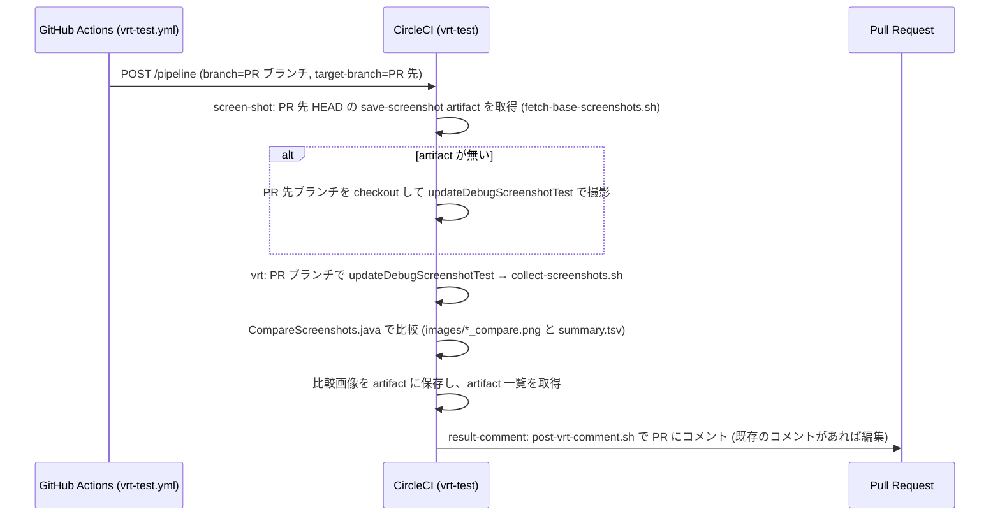

# ビルド・テスト・CI/CD・リリース

## 必要な環境

| 項目 | 値 |
| --- | --- |
| JDK | 21 (各モジュールで `jvmToolchain(21)`、`sourceCompatibility` / `targetCompatibility` も 21) |
| Android SDK | compileSdk 36 |
| Gradle | Wrapper 9.4.1 ([`gradle-wrapper.properties`](../gradle/wrapper/gradle-wrapper.properties)) |
| 動作端末 | Android 13 (API 33) 以上 |

## ローカルビルドに必要なファイル

次のファイルは `.gitignore` 済みで、リポジトリには含まれない。CI では Secrets から Base64 デコードして生成している。

| ファイル | 必須か | 用途 |
| --- | --- | --- |
| `app/src/debug/google-services.json` | debug ビルドに必要 | Firebase (google-services プラグインがビルド時に読む) |
| `app/src/release/google-services.json` | release ビルドに必要 | 同上 |
| `local.properties` | 任意 | SDK パスのほか、DeployGate 用の `deploygate.user` / `deploygate.token` |
| `siging.properties` | 任意 (release 署名には必要) | 署名情報。ファイル名の綴りは `siging` のまま |
| `debug.jks` | 任意 | 存在すれば debug 署名に使う。無ければ Android 標準の debug キーストア |
| `release.jks` | release 署名に必要 | release 署名 |

`siging.properties` のキー ([`app/build.gradle.kts`](../app/build.gradle.kts) の `signingConfigs`):

| キー | 用途 |
| --- | --- |
| `release.store_pass` / `release.alias` / `release.alias_pass` | `release.jks` のストアパスワード / エイリアス / キーパスワード |
| `debug.store_pass` / `debug.alias` / `debug.alias_pass` | `debug.jks` のストアパスワード / エイリアス / キーパスワード |

プロパティファイルが無くてもビルドスクリプトは落ちない (`readProperties` が空の `Properties` を返す)。

## ビルドタイプ

| | debug | release |
| --- | --- | --- |
| applicationId | `com.snowdango.sumire.debug` (`applicationIdSuffix = ".debug"`) | `com.snowdango.sumire` |
| アプリ名 | `SumireDebug` (`app/src/debug/res/values/strings.xml`) | `Sumire` |
| 難読化・縮小 | なし | `isMinifyEnabled = true` / `isShrinkResources = true` ([`proguard-rules.pro`](../app/proguard-rules.pro)) |
| 設定画面の Dev セクション (Crashlytics の動作確認) | 表示 | 非表示 |
| `BuildConfig.VERSION_NAME` | `:app` と `:presenter:settings` の両方に `buildConfigField` で埋め込む | 同左 |

ライブラリモジュールは release でも `isMinifyEnabled = false` (縮小はアプリ側の R8 でまとめて行う)。

## バージョン

`versionName` / `versionCode` は [`gradle/libs.versions.toml`](../gradle/libs.versions.toml) の `[versions]` にあり、`:app` と `:presenter:settings` がここから読む。上げるときは Claude Code のスキル `/version-up` ([`.claude/skills/version-up/SKILL.md`](../.claude/skills/version-up/SKILL.md)) で、`feature/version-up/<version>` ブランチの作成から develop 宛ての PR 作成まで行える。

## Gradle の設定

[`gradle.properties`](../gradle.properties) で次を有効にしている。

- `org.gradle.parallel=true` (並列ビルド) と `org.gradle.caching=true` (ビルドキャッシュ。CI のジョブ間で出力を再利用する前提)
- デーモンのヒープ `-Xmx4g`、Kotlin デーモンのヒープ `-Xmx2g`
- `android.experimental.enableScreenshotTest=true` (Compose Preview Screenshot Testing の `screenshotTest` ソースセットを有効にする。各モジュールの `build.gradle.kts` でも `experimentalProperties` に同じ値を入れている)

## よく使う Gradle タスク

| タスク | 内容 |
| --- | --- |
| `./gradlew assembleDebug` | debug APK のビルド |
| `./gradlew assembleRelease bundleRelease` | release APK / AAB のビルド (署名ファイルが必要) |
| `./gradlew testDebugUnitTest` | JVM ユニットテスト |
| `./gradlew :model:testDebugUnitTest --tests "com.snowdango.sumire.model.GetReportModelTest"` | テストクラスを指定して実行 |
| `./gradlew detekt` | detekt による静的解析 (CI では `--auto-correct` 付き) |
| `./gradlew lint` | Android Lint |
| `./gradlew updateDebugScreenshotTest` | `@PreviewTest` の Preview を撮影し、各モジュールの `src/screenshotTestDebug/reference/` に参照画像として保存する |
| `./gradlew validateDebugScreenshotTest` | 手元の参照画像と比較する (CI の VRT はこのタスクではなく、独自の比較ツールを使う) |
| `./gradlew uploadDeployGateDebug` | debug APK を DeployGate にアップロード (`local.properties` の DeployGate 設定が必要) |

## 静的解析

### detekt

ルートの [`build.gradle.kts`](../build.gradle.kts) で全サブプロジェクトに適用している。

- 設定ファイル: [`config/detekt/detekt.yml`](../config/detekt/detekt.yml) (`buildUponDefaultConfig = true` なので、書いていないルールは detekt のデフォルト)
- プラグイン: `detekt-formatting` (ktlint ベースの整形) と `io.nlopez.compose.rules` (Compose 用ルール)
- `autoCorrect = true`、`parallel = true`
- `ignoreFailures = true` のため、**指摘があってもタスクは失敗しない**。CI の lint ジョブも detekt の指摘では落ちない
- 各モジュールのレポートは `reportMerge` タスクで `reports/detekt.xml` にまとめられる
- 主な設定値: `MaxLineLength` 120、`MagicNumber` 有効 (テストと `.kts` は除外)、`FunctionNaming` / `LongParameterList` 無効。Room の DAO のように長いクエリ文字列がある箇所は `@Suppress("MaxLineLength")` で個別に抑制している

### Android Lint

ライブラリモジュール (`com.android.library`) に対して、ルートの `build.gradle.kts` から `abortOnError = true` / `checkDependencies = true` / テキストレポートを標準出力に出す設定を入れている。

## テスト

- ロジックのユニットテストは [`GetReportModelTest`](../model/src/test/java/com/snowdango/sumire/model/GetReportModelTest.kt) (月の範囲計算とレポートへの変換) だけ。他のモジュールの `ExampleUnitTest` / `ExampleInstrumentedTest` は Android Studio のテンプレートのまま。
- 画面の回帰は Compose Preview Screenshot Testing による VRT で確認している。

### VRT の仕組み

1. `:ui`, `:presenter:playing`, `:presenter:history`, `:presenter:report`, `:presenter:settings` に `com.android.compose.screenshot` プラグインを適用している。
2. 各モジュールの `src/screenshotTest/kotlin/` に、main の Preview を呼ぶだけの `@PreviewTest` 付き Composable を置く (例: [`ReportScreenshotTest.kt`](../presenter/report/src/screenshotTest/kotlin/com/snowdango/sumire/presenter/report/ReportScreenshotTest.kt))。撮影されるのはこの `@PreviewTest` だけで、`@Preview` のパラメータは main 側と揃える ([screens.md](screens.md#preview-とスクリーンショットテスト))。
3. `updateDebugScreenshotTest` で各モジュールの `src/screenshotTestDebug/reference/` に PNG が出力される。参照画像は `.gitignore` 済みでコミットしない (CI が PR 先ブランチで撮り直して比較するため)。
4. CI では PR 先ブランチと PR ブランチの画像を [`.circleci/collect-screenshots.sh`](../.circleci/collect-screenshots.sh) で 1 か所に集め (`<出力先>/<モジュールのパス>/...`)、[`.circleci/CompareScreenshots.java`](../.circleci/CompareScreenshots.java) で比較して PR にコメントする (下記)。

## CI/CD

CircleCI ([`.circleci/config.yml`](../.circleci/config.yml)) と GitHub Actions ([`.github/workflows`](../.github/workflows)) を併用している。

### CircleCI のワークフロー

| ワークフロー | 対象 | ジョブ |
| --- | --- | --- |
| `build-test` | `master` 以外の全ブランチの push | `lint` (`detekt --auto-correct`) と `build` (`assembleDebug`) を並列に実行し、`build` の後に `unittest` (`testDebugUnitTest`) |
| `release-build-test` | `develop` の push | `release-build` (`assembleRelease`) |
| `save-screenshot` | `develop`, `master` の push | `updateDebugScreenshotTest` で撮影し、画像を `screenshots/<モジュール>/...` の artifact として保存 (VRT の比較元として再利用される) |
| `vrt-test` | パイプラインパラメータ `target-branch` が空でないとき (GitHub Actions から API で起動) | `screen-shot` → `vrt` → `result-comment` |

- API で起動した VRT 用のパイプラインでは `vrt-test` 以外のワークフローは動かない (`when` で `target-branch` が空のときだけ動くようにしている)。
- 各ジョブはまず `local.properties` (空) / `siging.properties` / キーストア / `google-services.json` を環境変数から生成する。
- Gradle の依存キャッシュは独自コマンド `restore-gradle` / `save-gradle` で扱う。キーには `build.gradle*` / `settings.gradle*` / `*.versions.toml` / `gradle-wrapper.properties` のハッシュを使い、保存はテストまで実行して依存が揃うジョブ (`unittest` と VRT 系) だけで行う。
- `build` ジョブは `.gradle` / 各モジュールの `build` / Gradle のビルドキャッシュを workspace に入れて `unittest` に引き継ぐ。**モジュールを追加したら `config.yml` の `persist_to_workspace` の一覧にもその `build` ディレクトリを足す。**

### GitHub Actions

| ワークフロー | トリガー | 内容 |
| --- | --- | --- |
| [`vrt-test.yml`](../.github/workflows/vrt-test.yml) | `develop` 宛ての PR | CircleCI の API を叩き、`target-branch` = PR のベースブランチ、`pr-number` を渡して `vrt-test` パイプラインを起動 |
| [`deploygate-debug.yml`](../.github/workflows/deploygate-debug.yml) | `develop` への push | debug をビルドして DeployGate にアップロード |
| [`deploygate-release.yml`](../.github/workflows/deploygate-release.yml) (名前は `Release`) | 手動実行 (`workflow_dispatch`、入力 `tag`) | `assembleRelease bundleRelease` を 1 回の Gradle 起動で実行し、指定タグで GitHub Release を作成 (自動リリースノート、`make_latest`) |

どちらの Actions も `gradle/actions/setup-gradle@v4` (`cache-read-only: false`) で Gradle のキャッシュを使う。

### VRT のパイプライン

- **比較元 (PR 先ブランチ)**: [`fetch-base-screenshots.sh`](../.circleci/fetch-base-screenshots.sh) が、PR 先ブランチの HEAD と同じコミットで成功した `save-screenshot` ジョブの artifact を探してダウンロードする。見つからなければ PR 先ブランチを checkout して撮影する。PR 先がまだ Compose Preview Screenshot Testing を導入していない場合は比較元を空にし、PR 側の画像をすべて「追加」として扱う。
- **比較**: `CompareScreenshots.java` (JDK 11 以上の source-file mode で実行) が相対パスで画像を対応付け、1 ピクセルでも違うもの・PR 側にだけあるもの・PR 先にだけあるものについて、左から base / diff / PR を並べた `<名前>_compare.png` と、`summary.tsv` (`changed` / `added` / `deleted`) を出力する。
- **コメント**: [`post-vrt-comment.sh`](../.circleci/post-vrt-comment.sh) が次の順に試す。
  1. `VRT_COMMENT_TOKEN` (ユーザーの PAT) があれば `gh pr comment --attach` で画像を GitHub に直接アップロードして埋め込む (gh 2.99.0 以降が必要。GitHub App のトークンでは不可)。
  2. 無ければ、CircleCI artifact の URL を `` でそのまま埋め込む (artifact は 30 日で消えるので、古いコメントの画像は表示されなくなる)。
  3. artifact の一覧も取れなければ、名前だけのリンク表を貼る。

  投稿は GitHub App (`sumire-apps`) のトークン、または PAT で行う。

### 使用している Secrets / 環境変数

値はリポジトリに含めない。名前だけ列挙する。

| 名前 | 使う場所 | 内容 |
| --- | --- | --- |
| `SIGING_PROPERTIES` | CircleCI / Actions | `siging.properties` の Base64 |
| `DEBUG_JKS` / `RELEASE_JKS` | CircleCI / Actions | キーストアの Base64 |
| `DEBUG_SERVICE_JSON` / `RELEASE_SERVICE_JSON` | CircleCI / Actions | `google-services.json` の Base64 |
| `DEPLOYGATE_USER` / `DEPLOYGATE_TOKEN` | Actions | DeployGate のユーザー名とトークン |
| `CIRCLE_TOKEN` | Actions / CircleCI | CircleCI API (パイプライン起動、比較元 artifact の検索・取得、artifact 一覧の取得) |
| `GITHUB_APPS_ID` / `GITHUB_APPS_PRIVATE_KEY` | CircleCI | VRT 結果をコメントする GitHub App のトークン取得 |
| `VRT_COMMENT_TOKEN` | CircleCI (任意) | VRT の比較画像を PR コメントに直接添付するためのユーザーの PAT |

## ブランチ運用とリリース

- 作業ブランチは `develop` から切り、`develop` 宛てに PR を出す。PR の本文は [`.github/PULL_REQUEST_TEMPLATE.md`](../.github/PULL_REQUEST_TEMPLATE.md) の「概要」「変更点」の形式。
- Dependabot は Gradle の依存を毎週チェックし、`develop` 宛てに PR を作る (同時に開く PR は最大 10)。
- リリースの流れ:
  1. `/version-up` で `versionName` / `versionCode` を上げる PR を `develop` に出してマージする。
  2. `develop` → `master` のリリース PR をマージする (直近の例では `Release 0.0.5` というタイトルで squash マージしている)。
  3. GitHub Actions の `Release` ワークフローをタグを指定して手動実行し、GitHub Release に APK / AAB を添付する。
- ユーザーへの配布は GitHub Releases の APK ([README.ja.md](../README.ja.md#使用方法))。
