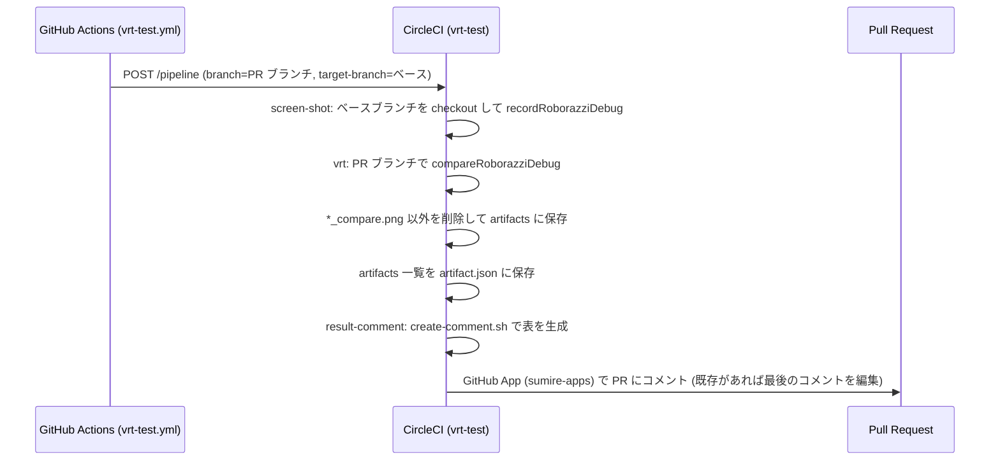

# ビルド・テスト・CI/CD・リリース

## 必要な環境

| 項目 | 値 |
| --- | --- |
| JDK | 21 (各モジュールで `jvmToolchain(21)`、`sourceCompatibility` / `targetCompatibility` も 21) |
| Android SDK | compileSdk 36 |
| Gradle | Wrapper 9.4.1 ([`gradle-wrapper.properties`](../gradle/wrapper/gradle-wrapper.properties)) |
| 動作端末 | Android 13 (API 33) 以上 |

## ローカルビルドに必要なファイル

次のファイルは `.gitignore` 済みで、リポジトリには含まれない。CI では Secrets から Base64 デコードして生成している。

| ファイル | 必須か | 用途 |
| --- | --- | --- |
| `app/src/debug/google-services.json` | debug ビルドに必要 | Firebase (google-services プラグインがビルド時に読む) |
| `app/src/release/google-services.json` | release ビルドに必要 | 同上 |
| `local.properties` | 任意 | SDK パスのほか、DeployGate 用の `deploygate.user` / `deploygate.token` |
| `siging.properties` | 任意 (release 署名には必要) | 署名情報。ファイル名の綴りは `siging` のまま |
| `debug.jks` | 任意 | 存在すれば debug 署名に使う。無ければ Android 標準の debug キーストア |
| `release.jks` | release 署名に必要 | release 署名 |

`siging.properties` のキー ([`app/build.gradle.kts`](../app/build.gradle.kts) の `signingConfigs`):

| キー | 用途 |
| --- | --- |
| `release.store_pass` / `release.alias` / `release.alias_pass` | `release.jks` のストアパスワード / エイリアス / キーパスワード |
| `debug.store_pass` / `debug.alias` / `debug.alias_pass` | `debug.jks` のストアパスワード / エイリアス / キーパスワード |

プロパティファイルが無くてもビルドスクリプトは落ちない (`readProperties` が空の `Properties` を返す)。

## ビルドタイプ

| | debug | release |
| --- | --- | --- |
| applicationId | `com.snowdango.sumire.debug` (`applicationIdSuffix = ".debug"`) | `com.snowdango.sumire` |
| アプリ名 | `SumireDebug` (`app/src/debug/res/values/strings.xml`) | `Sumire` |
| 難読化・縮小 | なし | `isMinifyEnabled = true` / `isShrinkResources = true` ([`proguard-rules.pro`](../app/proguard-rules.pro)) |
| Showkase | 有効 (`debugImplementation` / `kspDebug`) | 含まれない (`startShowkase` は空実装) |
| 設定画面の Dev セクション | 表示 | 非表示 |
| `BuildConfig.VERSION_NAME` | `:app` と `:presenter:settings` の両方に `buildConfigField` で埋め込む | 同左 |

ライブラリモジュールは release でも `isMinifyEnabled = false` (縮小はアプリ側の R8 でまとめて行う)。

## バージョン

`versionName` / `versionCode` は [`gradle/libs.versions.toml`](../gradle/libs.versions.toml) の `[versions]` にあり、`:app` と `:presenter:settings` がここから読む。上げるときは Claude Code のスキル `/version-up` ([`.claude/skills/version-up/SKILL.md`](../.claude/skills/version-up/SKILL.md)) で、`feature/version-up/<version>` ブランチの作成から develop 宛ての PR 作成まで行える。

## よく使う Gradle タスク

| タスク | 内容 |
| --- | --- |
| `./gradlew assembleDebug` | debug APK のビルド |
| `./gradlew assembleRelease` / `bundleRelease` | release APK / AAB のビルド (署名ファイルが必要) |
| `./gradlew testDebugUnitTest` | JVM ユニットテスト。`PreviewTest` も実行されるが、スクリーンショットの保存・比較は下の Roborazzi タスクで行う |
| `./gradlew detekt` | detekt による静的解析 (CI では `--auto-correct` 付き) |
| `./gradlew lint` | Android Lint |
| `./gradlew recordRoborazziDebug` | Preview のスクリーンショットを撮影して保存 |
| `./gradlew compareRoborazziDebug` | 保存済みスクリーンショットとの比較画像を生成 |
| `./gradlew uploadDeployGateDebug` | debug APK を DeployGate にアップロード (`local.properties` の DeployGate 設定が必要) |

## 静的解析

### detekt

ルートの [`build.gradle.kts`](../build.gradle.kts) で全サブプロジェクトに適用している。

- 設定ファイル: [`config/detekt/detekt.yml`](../config/detekt/detekt.yml) (`buildUponDefaultConfig = true` なので、書いていないルールは detekt のデフォルト)
- プラグイン: `detekt-formatting` (ktlint ベースの整形) と `io.nlopez.compose.rules` (Compose 用ルール)
- `autoCorrect = true`、`parallel = true`
- `ignoreFailures = true` のため、**指摘があってもタスクは失敗しない**。CI の lint ジョブも detekt の指摘では落ちない
- 各モジュールのレポートは `reportMerge` タスクで `reports/detekt.xml` にまとめられる
- 主な設定値: `MaxLineLength` 120、`MagicNumber` 有効 (テストと `.kts` は除外)、`FunctionNaming` / `LongParameterList` 無効。Room の DAO のように長いクエリ文字列がある箇所は `@Suppress("MaxLineLength")` で個別に抑制している

### Android Lint

ライブラリモジュール (`com.android.library`) に対して、ルートの `build.gradle.kts` から `abortOnError = true` / `checkDependencies = true` / テキストレポートを標準出力に出す設定を入れている。

## テスト

- 各モジュールの `ExampleUnitTest` / `ExampleInstrumentedTest` は Android Studio のテンプレートのままで、ロジックのユニットテストは現状ほぼ無い。
- 実質的な回帰テストは [`app/src/test/.../PreviewTest.kt`](../app/src/test/java/com/snowdango/sumire/PreviewTest.kt) によるスクリーンショットテストだけ。

### VRT の仕組み

1. Showkase が全モジュールの `@Preview` (private を除く) を収集する ([screens.md](screens.md#preview-と-showkase))。
2. `PreviewTest` は `ParameterizedRobolectricTestRunner` で `Showkase.getMetadata().componentList` の要素ごとにテストを生成する。端末設定は `RobolectricDeviceQualifiers.Pixel6`、`GraphicsMode.NATIVE`。
3. 各 Preview を Roborazzi の `captureRoboImage` で撮影し、`app/build/outputs/roborazzi/<group>_<componentName>_<componentKey>.png` に保存する (`componentName` の空白は除去)。
4. CI では PR のベースブランチで `recordRoborazziDebug` → PR ブランチで `compareRoborazziDebug` を実行し、差分画像を PR にコメントする (下記)。

## CI/CD

CircleCI ([`.circleci/config.yml`](../.circleci/config.yml)) と GitHub Actions ([`.github/workflows`](../.github/workflows)) を併用している。

### CircleCI のワークフロー

| ワークフロー | 対象 | ジョブ |
| --- | --- | --- |
| `build-test` | `master` 以外の全ブランチの push | `lint` (`detekt --auto-correct`) → `build` (`assembleDebug`) → `unittest` (`testDebugUnitTest`) |
| `release-build-test` | `develop` | `release-build` (`assembleRelease`) |
| `save-screenshot` | `develop`, `master` | `recordRoborazziDebug` を実行し、スクリーンショットを artifacts に保存 |
| `vrt-test` | パイプラインパラメータ `target-branch` が空でないとき (GitHub Actions から API で起動) | `screen-shot` → `vrt` → `result-comment` |

各ジョブはまず `local.properties` (空) / `siging.properties` / キーストア / `google-services.json` を環境変数から生成する。

### GitHub Actions

| ワークフロー | トリガー | 内容 |
| --- | --- | --- |
| [`vrt-test.yml`](../.github/workflows/vrt-test.yml) | `develop` 宛ての PR | CircleCI の API を叩き、`target-branch` = PR のベースブランチ、`pr-number` を渡して `vrt-test` パイプラインを起動 |
| [`deploygate-debug.yml`](../.github/workflows/deploygate-debug.yml) | `develop` への push | debug をビルドして DeployGate にアップロード |
| [`deploygate-release.yml`](../.github/workflows/deploygate-release.yml) (名前は `Release`) | 手動実行 (`workflow_dispatch`、入力 `tag`) | release の APK と AAB をビルドし、指定タグで GitHub Release を作成 (自動リリースノート、`make_latest`) |

### VRT のパイプライン

[`create-comment.sh`](../create-comment.sh) は `artifact.json` の各 artifact をリンクにした表 (「VRT Result」) を作る。差分が無ければ「not changed screen」とだけ書く。

### 使用している Secrets / 環境変数

値はリポジトリに含めない。名前だけ列挙する。

| 名前 | 使う場所 | 内容 |
| --- | --- | --- |
| `SIGING_PROPERTIES` | CircleCI / Actions | `siging.properties` の Base64 |
| `DEBUG_JKS` / `RELEASE_JKS` | CircleCI / Actions | キーストアの Base64 |
| `DEBUG_SERVICE_JSON` / `RELEASE_SERVICE_JSON` | CircleCI / Actions | `google-services.json` の Base64 |
| `DEPLOYGATE_USER` / `DEPLOYGATE_TOKEN` | Actions | DeployGate のユーザー名とトークン |
| `CIRCLE_TOKEN` | Actions / CircleCI | CircleCI API (パイプライン起動、artifacts 取得) |
| `GITHUB_APPS_ID` / `GITHUB_APPS_PRIVATE_KEY` | CircleCI | VRT 結果をコメントする GitHub App のトークン取得 |

## ブランチ運用とリリース

- 作業ブランチは `develop` から切り、`develop` 宛てに PR を出す。PR の本文は [`.github/PULL_REQUEST_TEMPLATE.md`](../.github/PULL_REQUEST_TEMPLATE.md) の「概要」「変更点」の形式。
- Dependabot は Gradle の依存を毎週チェックし、`develop` 宛てに PR を作る (同時に開く PR は最大 10)。
- リリースの流れ:
  1. `/version-up` で `versionName` / `versionCode` を上げる PR を `develop` に出してマージする。
  2. `develop` → `master` のリリース PR をマージする (直近の例では `Release 0.0.5` というタイトルで squash マージしている)。
  3. GitHub Actions の `Release` ワークフローをタグを指定して手動実行し、GitHub Release に APK / AAB を添付する。
- ユーザーへの配布は GitHub Releases の APK ([README.ja.md](../README.ja.md#使用方法))。
