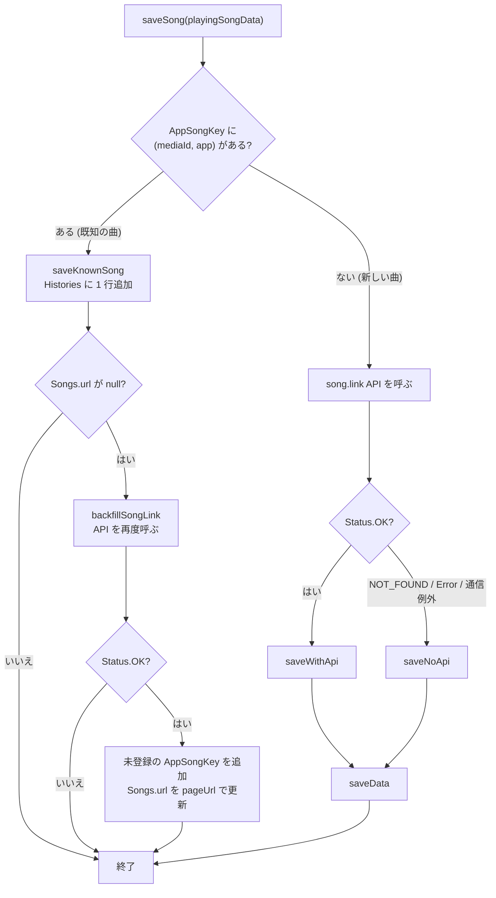
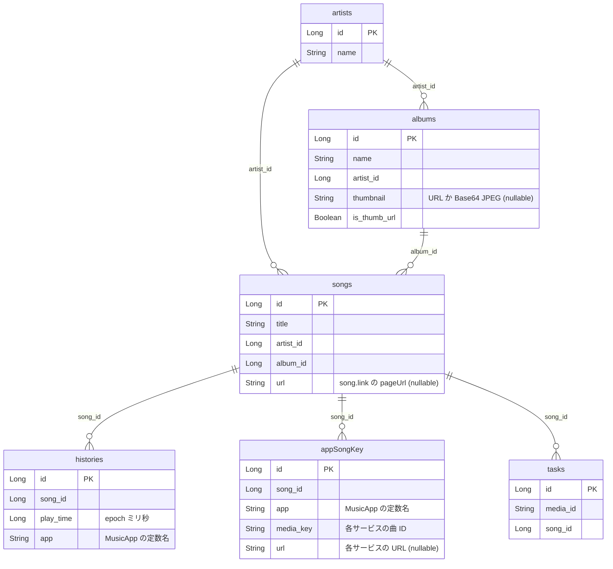

# 保存・DB・API・設定

再生が確定した曲を Room に保存する流れと、そのとき使う song.link API、DB スキーマ、読み出し・集計のクエリ、DataStore の設定値をまとめる。

## 保存フロー (SaveModel)

入口は [`SaveModel.saveSong(playingSongData)`](../model/src/main/java/com/snowdango/sumire/model/SaveModel.kt)。呼ぶのは `PlayingSongSharedFlow` だけ ([playback-detection.md](playback-detection.md#保存タイミング-handlestatechange))。

### saveData の手順

`saveWithApi` と `saveNoApi` はどちらも最後に `saveData` を呼ぶ。中身は次の順に実行し、トランザクションは張っていない。

1. **Artists**: `name` が一致する行があればその ID、無ければ insert。
2. **Albums**: `name` と `artistId` が一致する行があればその ID、無ければ insert。サムネイルはアルバムを新規作成したときだけ保存される。
3. **Songs**: 常に insert (重複チェックなし。新しい曲として扱うのは `AppSongKey` が見つからなかったときだけなので、通常は重複しない)。
4. **Histories**: 再生 1 回につき 1 行 insert。
5. **AppSongKey**: その曲に紐づくキーを取得し、`(app, mediaKey)` がまだ無いものだけ insert。
6. **Tasks**: API の結果が `Status.Error` のときだけ `(mediaId, songId)` を insert。

### API あり / なしで保存される値の違い

| 保存先 | `saveWithApi` (Status.OK) | `saveNoApi` (NOT_FOUND / Error / 例外) |
| --- | --- | --- |
| `Albums.thumbnail` | 問い合わせたエンティティ (`entityUniqueId`) の `thumbnailUrl` → 無ければ他エンティティの先頭 → それも無ければ再生中のアートワークを Base64 化 | 再生中のアートワークを Base64 化 (無ければ null) |
| `Albums.isThumbUrl` | `thumbnailUrl` を使ったら true | false |
| `Songs.url` | `pageUrl` (song.link のページ URL)。空なら null | null (既知の曲として再生されたときに backfill される) |
| `AppSongKey` | API の各エンティティ (`apiProvider` → `MusicApp`) の ID + 再生元アプリの mediaId。URL は `linksByPlatform` (platform → `MusicApp`) から | 再生元アプリの mediaId だけ (URL なし) |
| `Tasks` | 書かない | `Status.Error` (と通信例外) のときだけ書く |

- 再生元アプリの mediaId は必ず `AppSongKey` に保存する。次回以降はこのキーで既知の曲と判定し、API を呼ばずに履歴だけ追加する。
- API のエンティティに再生元アプリのものが含まれていても、`keyMap + (app to mediaId)` で再生元の mediaId が優先される。
- 通信例外 (`CancellationException` 以外) は `Log.w` を出して `null` 扱いにし、ローカル情報だけで保存する。

### アートワークの Base64 化

[`Bitmap?.toBase64()`](../data/src/main/java/com/snowdango/sumire/data/util/BitmapExtension.kt) は長辺 512px に縮小した JPEG (品質 85) を `Base64.NO_WRAP` で文字列化する。元画像をそのまま PNG にすると 1 行が数百 KB を超え、SQLite の `CursorWindow` の上限に当たるため。逆変換は [`String?.toBitmap()`](../data/src/main/java/com/snowdango/sumire/data/util/StringExtension.kt) で、壊れた文字列は `null` (画像なし) として扱う。ウィジェットの状態にも同じ形式で保存している。

## song.link API

| 項目 | 内容 |
| --- | --- |
| クライアント | [`KtorClient`](../repository/src/main/java/com/snowdango/sumire/repository/ktor/KtorClient.kt) (Android エンジン) |
| ベース URL | `https://api.song.link/v1-alpha.1` (`DefaultRequest`) |
| リクエスト | `GET /v1-alpha.1/links?platform=<MusicApp.platform>&type=song&id=<mediaId>&userCountry=JP` |
| ヘッダ | `Content-Type: application/json` |
| 認証 | なし (API キー未使用) |
| JSON | `ContentNegotiation` + `DefaultJson` |
| ログ | `Logging` プラグイン、`Logger.ANDROID`、`LogLevel.INFO` |
| エラー | `expectSuccess = false`。ステータスは自前で判定する |

ステータスの変換 ([`SongLinkApi`](../repository/src/main/java/com/snowdango/sumire/repository/SongLinkApi.kt)):

| HTTP | `SongLinkResponse.Status` | 本文 |
| --- | --- | --- |
| 200 | `OK` | `SongLinkData` にデシリアライズ |
| 400 / 404 | `NOT_FOUND` | パースせず空の `SongLinkData()` |
| その他 (429, 5xx など) | `Error` | パースせず空の `SongLinkData()` (JSON とは限らないため) |

レスポンスモデル ([`data/entity/songlink`](../data/src/main/java/com/snowdango/sumire/data/entity/songlink/)):

- `SongLinkData`: `entityUniqueId`, `pageUrl`, `entitiesByUniqueId: Map<String, EntityByUniqueId>`, `linksByPlatform: Map<String, LinkByPlatform>` など。全フィールドにデフォルト値があり、欠けていても失敗しない。
- `EntityByUniqueId`: `id`, `title`, `artistName`, `thumbnailUrl`, `apiProvider`, `platforms` など。
- `LinkByPlatform`: `url`, `entityUniqueId`, `nativeAppUriMobile` など。

`MusicApp` との対応:

| `MusicApp` | `apiProvider` | `platform` | 再生検知 (`packageName`) |
| --- | --- | --- | --- |
| `APPLE_MUSIC` | `itunes` | `appleMusic` | `com.apple.android.music` |
| `SPOTIFY` | `spotify` | `spotify` | `com.spotify.music` |
| `YOUTUBE` | `youtube` | `youtubeMusic` | - |
| `GOOGLE` | `google` | `google` | - |
| `PANDORA` | `pandora` | `pandora` | - |
| `DEEZER` | `deezer` | `deezer` | - |
| `AMAZON` | `amazon` | `amazonMusic` | - |
| `TIDAL` | `tidal` | `tidal` | - |
| `NAPSTER` | `napster` | `napster` | - |
| `YANDEX` | `yandex` | `yandex` | - |

## DB スキーマ (Room)

- Database: [`SongsDatabase`](../repository/src/main/java/com/snowdango/sumire/repository/SongsDatabase.kt)、ファイル名 `song_db`、`version = 3`
- `exportSchema = true`、出力先は `repository/schemas` (KSP 引数 `room.schemaLocation`)。ただし現時点でスキーマ JSON はリポジトリにコミットされていない
- Migration は登録しておらず、`fallbackToDestructiveMigration` も指定していない
- インスタンスは `getInstance()` で `synchronized` + `@Volatile` のシングルトン。Koin からも `single` で配っている
- TypeConverter: [`LocalDataTimeConverter`](../repository/src/main/java/com/snowdango/sumire/repository/typeconverter/LocalDataTimeConverter.kt) (`LocalDateTime` ⇔ epoch ミリ秒。変換時の端末タイムゾーンを使う)
- enum (`MusicApp`) は Room の標準変換で **定数名の文字列** (`APPLE_MUSIC` など) として保存される

外部キー制約・ユニーク制約・インデックスは定義していない。重複を避けるのはすべてアプリ側の「先に検索してから insert」で行っている。DAO の `@Insert` は全部 `OnConflictStrategy.IGNORE` だが、主キーは自動採番なので実際に衝突することはない。

| テーブル | エンティティ | 用途 |
| --- | --- | --- |
| `artists` | `Artists` | アーティスト名。名前だけで同一判定する |
| `albums` | `Albums` | アルバム名 + アーティストで同一判定。サムネイルはここに持つ |
| `songs` | `Songs` | 曲。song.link のページ URL を持つ |
| `histories` | `Histories` | 再生履歴。1 再生 = 1 行。どのアプリで再生したかも持つ |
| `appSongKey` | `AppSongKey` | 「どのサービスのどの ID がどの曲か」の対応表。既知の曲の判定と共有 URL の解決に使う |
| `tasks` | `Tasks` | API が `Error` だった曲の記録。現在は書き込みのみで、読み出す処理は無い |

リレーション用のクラス ([`data/entity/db/relations`](../data/src/main/java/com/snowdango/sumire/data/entity/db/relations/)):

- `HistorySong` = `Histories` + `SongMetadata`
- `SongMetadata` = `Songs` + `Artists` + `Albums`
- `SongAppKeys` = `AppSongKey` + `SongKeys`、`SongKeys` = `Songs` + `List<AppSongKey>`

### DAO

| DAO | メソッド | 内容 |
| --- | --- | --- |
| `ArtistsDao` | `getArtist(name)` | 名前完全一致で ID を 1 件 |
| `AlbumsDao` | `getIdByNameAndArtistId(name, artistId)` | 名前 + アーティストで ID を 1 件 |
| `SongsDao` | `getSearchTitle(searchText)` | `title LIKE :searchText ESCAPE '\'`、最大 6 件 (検索候補用) |
| | `updateUrl(id, url)` | `songs.url` の更新 (backfill 用) |
| `HistoriesDao` | `getPagingHistorySongs()` | 全履歴を `play_time` 降順で `PagingSource` |
| | `getPagingSearchHistorySong(text)` | `songs` と inner join し `title LIKE :text ESCAPE '\'`、`play_time` 降順で `PagingSource` |
| | `getHistoriesSongRecent(size)` | 直近 `size` 件を `Flow<List<HistorySong>>` (DB 更新で再発行) |
| | `getPlaySummary(start, end)` | 期間内の再生回数・曲の種類数・アーティストの種類数を `Flow<PlaySummary>` |
| | `getTopSongs(start, end, limit)` | 期間内の曲ごとの再生回数ランキング (`Flow<List<SongPlayCount>>`、アルバムのサムネイル付き) |
| | `getTopArtists(start, end, limit)` | 期間内のアーティストごとの再生回数ランキング (`Flow<List<ArtistPlayCount>>`) |
| `AppSongKeyDao` | `getAppKeys(key, app)` | `(media_key, app)` で 1 件 + 同じ曲の全キー (`SongAppKeys`) |
| | `getBySongId(songId)` | 曲に紐づく全キー |
| `TasksDao` | `insert` のみ | |

### 集計クエリ (レポート用)

[`HistoriesDao`](../repository/src/main/java/com/snowdango/sumire/repository/dao/HistoriesDao.kt) の `getPlaySummary` / `getTopSongs` / `getTopArtists` はレポート画面のための集計クエリ。

- 期間は `startInclusive` 以上 `endExclusive` 未満。引数の `LocalDateTime` は TypeConverter で epoch ミリ秒に変換されて `histories.play_time` と比較される。
- 結合と期間の条件は、ファイル先頭の `private const val` (`HISTORIES_JOIN_SONGS`, `JOIN_ARTISTS`, `JOIN_ALBUMS`, `PLAY_TIME_IN_RANGE`) を組み合わせて作っている。
- ランキングは再生回数の降順で、同数のときは最後に再生した時刻 (`max(play_time)`) が新しいほうを上にする。
- 戻り値は Room のエンティティではない集計用の data class で、[`data/entity/db/report`](../data/src/main/java/com/snowdango/sumire/data/entity/db/report/) にある (`PlaySummary`, `SongPlayCount`, `ArtistPlayCount`)。SQL の別名は各クラスの `COLUMN_*` 定数に合わせる。
- 戻り値は `Flow` なので、期間内に新しい再生が保存されると再発行される。

LIKE に渡す文字列は [`String.escapeLike()`](../data/src/main/java/com/snowdango/sumire/data/util/StringExtension.kt) で `\`, `%`, `_` をエスケープしてから、Model 側でワイルドカードを付ける。

| 呼び出し元 | パターン | 意味 |
| --- | --- | --- |
| `GetHistoriesModel.getPagingSearchHistorySongs` | `%<text>%` | 部分一致 |
| `GetSongsModel.getSearchTitleList` | `<text>%` | 前方一致 |

## 読み出し側の Model

| Model | 主なメソッド | 内容 |
| --- | --- | --- |
| [`GetHistoriesModel`](../model/src/main/java/com/snowdango/sumire/model/GetHistoriesModel.kt) | `getRecentHistoriesSongFlow(size)` | 直近の履歴を `SongCardViewData` に変換。`playTimeText` は `"3m ago"` 形式の相対時刻 |
| | `getPagingHistorySongs()` / `getPagingSearchHistorySongs(text)` | `PagingSource` をそのまま返す (変換は ViewModel 側で `PagingData.map`) |
| | `convertRecentSongToSongCardViewData(historySong, type)` | `playTimeText` を `LocalDateTimeFormatType` の書式で作る |
| [`GetSongsModel`](../model/src/main/java/com/snowdango/sumire/model/GetSongsModel.kt) | `getSearchTitleList(text)` | 検索候補のタイトル一覧 |
| [`GetReportModel`](../model/src/main/java/com/snowdango/sumire/model/GetReportModel.kt) | `getCurrentMonthReportFlow()` | 当月のレポート。collect を始めた時点の年月を求め、`getMonthlyReportFlow` に切り替える |
| | `getMonthlyReportFlow(yearMonth)` | 月初 0 時〜翌月初 0 時 (含まない) の集計 3 種を `combine` し、`MonthlyReportViewData` (ランキングは曲 5 件 / アーティスト 3 件、順位は 1 始まり) に変換する |
| [`ShareSongModel`](../model/src/main/java/com/snowdango/sumire/model/ShareSongModel.kt) | `getUrl(mediaId, appPlatform)` | ウィジェットで共有する URL を決める (下記) |
| [`SettingsModel`](../model/src/main/java/com/snowdango/sumire/model/SettingsModel.kt) | 各設定の get / set / Flow | `SettingsUseCase` の薄いラッパー |

日時の書式 ([`LocalDateTime.kt`](../data/src/main/java/com/snowdango/sumire/data/util/LocalDateTime.kt)):

- `LocalDateTimeFormatType`: `ONLY_DATE` = `yyyy/MM/dd`、`FULL_DATE_TIME` = `yyyy/MM/dd-HH:mm:ss`、`ONLY_TIME` = `HH:mm:ss`、`YEAR_MONTH` = `yyyy/MM` (レポートの見出し用)
- `toLastDateTimeString(current)`: 差分が 1 日以上なら `Nd ago`、1 時間以上なら `Nh ago`、1 分以上なら `Nm ago`、1 秒以上なら `Ns ago`、それ未満 (未来の時刻も含む) は `now`

### 共有 URL の解決 (ShareSongModel.getUrl)

1. `appPlatform` から `MusicApp` を引く。mediaId が空か、アプリが見つからなければ `null`。
2. `AppSongKey` を `(mediaId, app)` で引き、同じ曲の全キーから `platform → url` のマップを作る。`Songs.url` があれば `songlink` キーで追加する。
3. 設定の「URL 取得時に優先されるサービス」(`UrlPriorityPlatform`) の URL → `songlink` の URL → マップ内の任意の URL の順で返す。

## 設定 (DataStore)

- `SumireApp` の `preferencesDataStore(name = "settings")` を Koin の `single` で配る。読み書きは [`SettingsUseCase`](../usecase/src/main/java/com/snowdango/sumire/usecase/setting/SettingsUseCase.kt) に集約している。
- ウィジェットごとの表示状態は Glance が別の DataStore で管理しており、ここには含まれない ([widget.md](widget.md#ウィジェットの状態))。

| キー | 型 | 保存する値 | デフォルト | 用途 |
| --- | --- | --- | --- | --- |
| `is_first_time` | Boolean | | `true` | 初回起動時の通知権限ダイアログ表示 |
| `widget_action_type` | String | `WidgetActionType` の定数名 (`COPY` / `TWITTER`) | `COPY` | ウィジェットタップ時の動作 |
| `url_platform` | String | `UrlPriorityPlatform.platform` (`appleMusic`, `songlink` など) | `songlink` (`SONG_LINK`) | 共有時に優先するサービス |

`settingsFlow()` はこれらを `SettingsPreferences(widgetActionType, urlPlatform)` にまとめた `Flow` を返す。保存値が enum に無い場合はデフォルトに戻る。

`UrlPriorityPlatform` は `MusicApp` の全 platform に `SONG_LINK("songlink")` を加えた enum で、文字列は `MusicApp.platform` と揃えておく必要がある。
