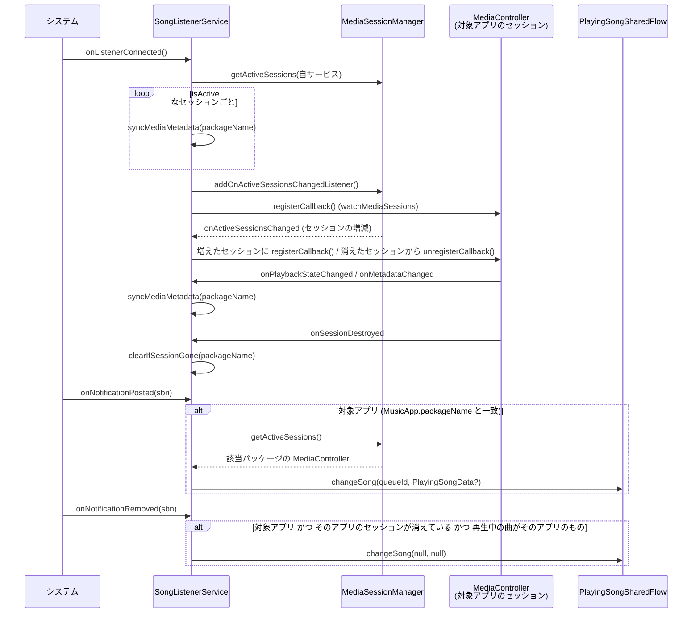
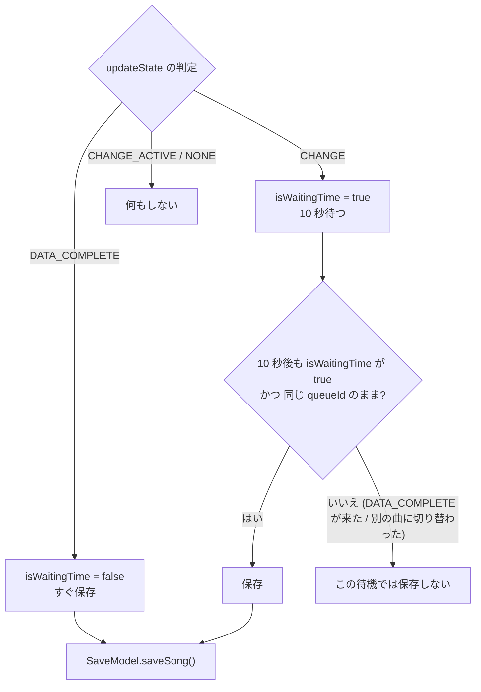

# 再生検知と再生中の曲の状態管理

音楽アプリの通知と MediaSession のコールバックをきっかけにメタデータを取り出し、「今再生中の曲」をメモリ上に保持する仕組み。曲ごとの再生時間もここで測る。

## 関係するクラス

| クラス | モジュール | 役割 |
| --- | --- | --- |
| [`SongListenerService`](../app/src/main/java/com/snowdango/sumire/service/SongListenerService.kt) | `:app` | `NotificationListenerService`。通知の追加・削除と、対象アプリの MediaSession のコールバックを受けて MediaSession を読みに行く |
| [`MusicApp`](../data/src/main/java/com/snowdango/sumire/data/entity/MusicApp.kt) | `:data` | 対応サービスの enum。`packageName` が空でないものが再生検知の対象 |
| [`PlayingSongData` / `SongData`](../data/src/main/java/com/snowdango/sumire/data/entity/playing/) | `:data` | 再生中の曲の値オブジェクト |
| [`PlayingSongSharedFlow`](../infla/src/main/java/com/snowdango/sumire/infla/PlayingSongSharedFlow.kt) | `:infla` | 再生中の曲の保持、変化の判定、通知、保存タイミングの決定、再生時間の書き込み |
| [`ListeningSession`](../infla/src/main/java/com/snowdango/sumire/infla/ListeningSession.kt) | `:infla` | 1 曲分の再生時間の計測と、書き込み先の履歴 ID の受け渡し |
| [`EventSharedFlow`](../infla/src/main/java/com/snowdango/sumire/infla/EventSharedFlow.kt) | `:infla` | 曲が変わったことを画面側に知らせるイベントバス |
| [`Logging`](../app/src/main/java/com/snowdango/sumire/logging/Logging.kt) | `:app` | debug ビルドで MediaMetadata / PlaybackState をログ出力する |

## サービスの起動と権限

マニフェスト ([`app/src/main/AndroidManifest.xml`](../app/src/main/AndroidManifest.xml)):

- `SongListenerService` は `BIND_NOTIFICATION_LISTENER_SERVICE` で保護され、`android.service.notification.NotificationListenerService` の intent-filter を持つ。
- `android:foregroundServiceType="mediaPlayback"`。Android 14 以降で必要な `FOREGROUND_SERVICE_MEDIA_PLAYBACK` 権限は `minSdkVersion="34"` 付きで宣言している。
- 他に `FOREGROUND_SERVICE`, `INTERNET`, `POST_NOTIFICATIONS` を宣言している。

起動経路:

1. ユーザーが端末設定で「通知へのアクセス」を許可すると、システムがサービスに bind する (`onBind`)。
2. `MainActivity.onStart()` でも、通知リスナーが有効 (`NotificationManagerCompat.getEnabledListenerPackages` に自パッケージが含まれる) なら `startForegroundService()` で起動する。設定画面から戻ってきたときも `onStart` で権限状態を見直す。

`onBind` と `onStartCommand` の両方で `startForeground()` を呼ぶ。`startForegroundService()` で起動した場合は 5 秒以内に `startForeground()` を呼ばないと例外になるため。

- 通知チャンネル: ID `sumire_song_listener` / 名前 `SumireSongListener` / `IMPORTANCE_NONE` / ロック画面では `VISIBILITY_PRIVATE`
- 通知: smallIcon と `app_name` のタイトルを必ず設定する (無いとシステムが汎用の「実行中」通知に差し替える)。`setOngoing(true)`
- `onStartCommand` の戻り値は `START_NOT_STICKY`

## メタデータの取得

- `getActiveSessions()` は通知リスナーが接続されてから呼ぶ必要があるため、初回の読み込みは `onListenerConnected()` で行う。
- 通知を出し直さずに一時停止・曲送りするアプリもあるため、`onListenerConnected()` で `addOnActiveSessionsChangedListener` を登録し、対象アプリのセッションごとに `MediaController.Callback` を登録する (`watchMediaSessions`)。セッションが増減するたびに登録し直し、`onListenerDisconnected()` / `onDestroy()` で全部外す。コールバックと登録の管理はすべてメインスレッドで行う。
  - `onPlaybackStateChanged`: 再生位置が進むたびに呼ぶアプリもあるので、`isActive` か `activeQueueItemId` が前回と変わったときだけ `syncMediaMetadata` する。
  - `onMetadataChanged`: そのまま `syncMediaMetadata` する。
  - `onSessionDestroyed`: `clearIfSessionGone` する。
  - 通知とコールバックの両方から同じ変化が届くことがあるが、`changeSong()` は変化が無ければ何もしない (`NONE`)。
  - 登録時に `SecurityException` (通知へのアクセスが外された直後など) が出たらログだけ出し、通知からの検知だけで動く。
- 処理はすべてアプリスコープで `launch` し、`CancellationException` 以外の例外はログに出して握りつぶす。
- 対象アプリの判定は `MusicApp.entries.any { it.packageName.isNotEmpty() && it.packageName == packageName }`。現状 `packageName` を持つのは `APPLE_MUSIC` (`com.apple.android.music`) と `SPOTIFY` (`com.spotify.music`) だけで、他の enum 値は URL 取得用。
- 通知が消えても、曲の切り替え時に一瞬消えただけならセッションは残っているので何もしない (`clearIfSessionGone`)。

### queueId の決め方

`resolveQueueId()` は次の順で最初に取れた値を使う。

1. `playbackState.activeQueueItemId` (`MediaSession.QueueItem.UNKNOWN_ID` を除く)
2. `controller.queue` の先頭要素の `queueId` (再生中の曲とは限らないのでフォールバック扱い)
3. `METADATA_KEY_MEDIA_ID` の `hashCode().toLong()`
4. どれも取れなければ `null`

queueId は「曲が切り替わったか」の判定だけに使う。DB には保存しない。

### PlayingSongData の組み立て

`createPlayingSongData()` が `MediaMetadata` から作る。

| フィールド | 取得元 | 補足 |
| --- | --- | --- |
| `songData.title` | `METADATA_KEY_TITLE` | 無ければ曲として扱わず `null` を返す (= 再生中の曲なし扱い) |
| `songData.artist` | `METADATA_KEY_ARTIST` | 無ければ空文字 |
| `songData.album` | `METADATA_KEY_ALBUM` | 無ければ空文字 |
| `songData.app` | 通知元のパッケージ名から引いた `MusicApp` | |
| `songData.artwork` | `METADATA_KEY_ART`、無ければ `METADATA_KEY_ALBUM_ART` | `Bitmap?`。アプリによっては後から届く |
| `songData.mediaId` | `METADATA_KEY_MEDIA_ID` | 無ければ `"<platform>:<title>:<artist>:<album>"` |
| `isActive` | `playbackState.isActive` | 再生中なら true、一時停止中などは false |
| `playTime` | 現在時刻 (システムのタイムゾーンの `LocalDateTime`) | 同じ曲の状態更新では最初の時刻を引き継ぐ |

## PlayingSongSharedFlow の状態遷移

`changeSong(queueId, playingSongData)` が唯一の入口。内部状態は `PlayingState(queueId, data, listeningSession)?` の 1 つだけで、`Mutex` で排他している。メモリ上にしか持たないので、プロセスが終了すると消える。

### 変化の判定 (`updateState`)

| 条件 | 判定 (`PlayingSongChangeType`) | 状態の更新 | 通知 |
| --- | --- | --- | --- |
| queueId が現在と異なり、queueId と data がどちらも非 null、artwork あり | `DATA_COMPLETE` | 新しい曲に置き換え | する |
| queueId が現在と異なり、queueId と data がどちらも非 null、artwork なし | `CHANGE` | 新しい曲に置き換え | する |
| queueId が現在と異なり、queueId か data が null | `NONE` | `null` (再生中の曲なし) にする | する |
| queueId が同じで `isActive` が変わった | `CHANGE_ACTIVE` | data を更新 (`playTime` と `listeningSession` は引き継ぐ) | する |
| queueId が同じで、artwork が null → 非 null になった | `DATA_COMPLETE` | data を更新 (`playTime` と `listeningSession` は引き継ぐ) | する |
| 上記以外 (同じ曲で変化なし、data が null など) | `NONE` | 変更しない | しない |

「通知する」場合は次の 2 つを行う。

1. `listener?.invoke(現在の曲)` — ウィジェットの更新用。`listener` は 1 つしか登録できない変数で、現在は `WidgetViewModel` が設定している ([widget.md](widget.md#更新経路))。
2. `EventSharedFlow.postEvent(ChangeCurrentSong)` — 再生中画面の更新と Analytics 送信用。曲が `null` になったとき (停止時) も送る。

### 保存タイミング (`handleStateChange`)

アートワークが曲の切り替えより遅れて届くアプリがあるため、アートワークが揃うのを最大 10 秒 (`METADATA_WAIT_TIMEOUT_MS`) 待ってから保存する。

ここから導かれる挙動:

- アートワーク付きで届いた曲は、すぐスキップしても保存される。
- アートワークが無いまま 10 秒以内に次の曲へ切り替わった曲は保存されない (`isWaitingTime` は 1 つしかなく、次の曲が上書きするため)。
- 同じ曲で `isActive` の変化とアートワークの到着が同時に来た場合は `CHANGE_ACTIVE` が優先されるので即保存はされず、10 秒待機のタイムアウト側で保存される。
- `CHANGE` のとき `changeSong()` 自体が 10 秒間 suspend する。呼び出し元 (`SongListenerService`) は通知ごとに別コルーチンで呼ぶので、次の通知処理は止まらない。
- 一時停止 → 再開 (`CHANGE_ACTIVE`) では保存しない。同じ曲をリピートしても queueId が変わらなければ保存されない。
- `metaDataComplete` は `SaveModel.saveSong()` が返した履歴の ID で `ListeningSession.historyId` を完了させる。保存に失敗したときも `finally` で `null` にして完了させる。

保存処理そのものは [persistence.md](persistence.md#保存フロー-savemodel) を参照。

### 再生時間の計測 (`ListeningSession`)

曲 (キューアイテム) ごとに `ListeningSession` を 1 つ作り、`isActive` が true だった区間の長さだけを足していく。区間の長さは再生位置ではなく `SystemClock.elapsedRealtime()` の差で測るので、シークしても実際に流れた時間になり、端末のスリープ中も進み、時刻の変更でずれない。

| きっかけ (`updateState` の中) | `ListeningSession` の操作 | 書き込み |
| --- | --- | --- |
| queueId が変わり、新しい曲が `isActive` | 新しいセッションを作って `resume()` | - |
| queueId が変わった (別の曲・再生中の曲なし) | 前の曲のセッションを `finish()` (最後の区間を締める) | 締めた区間を書き込む |
| 同じ曲で `isActive` が false → true (`CHANGE_ACTIVE`) | `resume()` | - |
| 同じ曲で `isActive` が true → false (`CHANGE_ACTIVE`) | `pause()` | 締めた区間を書き込む |
| 再生が続いたまま 5 分 (`LISTENING_CHECKPOINT_INTERVAL_MS`) 経った | `checkpoint()` (区間を区切って計測は続ける) | 区切った区間を書き込む |

- 書き込みは `SaveModel.addListeningTime(historyId, ms)` で、`histories.listening_ms` に **足し込む** ([persistence.md](persistence.md#再生時間の書き込み))。一時停止のたびに書くので、1 曲の再生時間は複数回に分けて届く。曲の終わりを待たないのは、プロセスが終了しても一時停止までの分を残すため。
- 履歴の ID は保存が終わるまで (アートワーク待ちの最大 10 秒 + song.link API) 分からない。そのため書き込みはアプリスコープで `launch` し、`ListeningSession.historyId` (`CompletableDeferred<Long?>`) を `await` してから行う。`changeSong()` の呼び出し元は待たない。
- 保存は再生中の曲に対してしか行わないので、保存が始まらないまま `finish()` した曲はこの先も保存されない。このとき `historyId` を `null` で完了させ、待っている書き込みを捨てる (アートワークが無いまま 10 秒以内にスキップされた曲など)。
- 0 ミリ秒の区間 (一時停止中に曲が切り替わったなど) は書き込まない。新しい履歴は `listening_ms = 0` で作るので、一度も再生しなかった履歴は 0 のまま。
- 5 分ごとの区切りは、再開・曲の切り替えのたびにタイマー (`checkpointJob`、アプリスコープ) を作り直して数え直す。一時停止・曲の終わりで止める。間隔より短い曲では区切りの書き込みは発生しない。書き込むたびに `histories` を読む Room の Flow / Paging が読み直すので、間隔は短くしすぎない。

計測の限界:

- 計測中の区間はメモリ上にしか無いので、再生中にプロセスが終了すると、最後に区切った (または再開した・曲が始まった) ときからの分、最大 5 分が失われる。
- `MediaController.Callback` を登録できなかったとき (`SecurityException`) は通知の更新でしか一時停止に気づけないので、通知を出し直さないアプリでは次の通知まで再生中として数える。
- queueId が変わらないリピート再生は 1 件の履歴にまとめて足される (回数は 1 のまま、時間は流れた分だけ増える)。

## 再生中の曲を読む側

| 読む側 | 方法 |
| --- | --- |
| 再生中画面 (`PlayingViewModel`) | 初期化時と `ChangeCurrentSong` イベント受信時に `getCurrentPlayingSong()` を読み、`StateFlow` に流す |
| ウィジェット (`WidgetViewModel`) | `listener` で受け取る。初期化時にも `getCurrentPlayingSong()` を読む |
| ウィジェットの Worker (`PlayingSongWorker`) | 実行時に `getCurrentPlayingSong()` を読む |
| Analytics (`SumireApp.initEventListener`) | `ChangeCurrentSong` 受信時に `getCurrentPlayingSong()` を読み、`save_song_data` イベントを送る (曲が null なら送らない) |

## デバッグ

- `BuildConfig.DEBUG` のとき、`syncMediaMetadata` のたびに `Logging` が `MediaMetadata` の主要キーと `PlaybackState` の状態・actions (ビットマスクを全列挙) を Logcat に出す。タグは `CurrentMetadata` / `CurrentPlaybackState` / `CurrentPlaybackAction`。
- 保存が走ると `PlayingSongSharedFlow` がタグ `CurrentPlayingSong` で `DataComplete` を出す。
- `SongListenerService.loggingMediaNotification()` は現在どこからも呼ばれていない。
