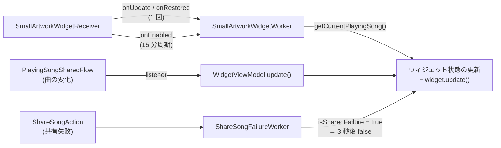
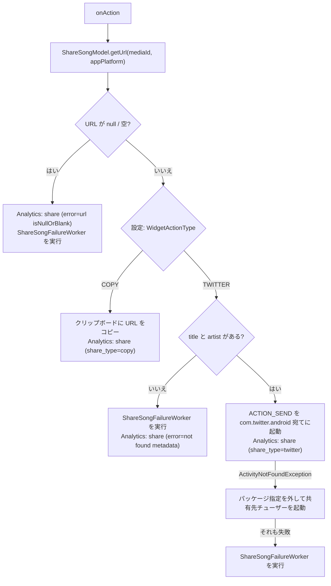

# ウィジェット

ホーム画面に置く 1×1 のウィジェット「Small Artwork Only」。再生中の曲のアートワークとタイトルを表示し、タップで曲の URL をコピーするか X に共有する。Jetpack Glance で実装している。

## 構成

| クラス | モジュール | 役割 |
| --- | --- | --- |
| [`SmallArtworkWidgetReceiver`](../app/src/main/java/com/snowdango/sumire/receiver/SmallArtworkWidgetReceiver.kt) | `:app` | `GlanceAppWidgetReceiver`。ウィジェットの追加・削除・更新要求を受けて Worker を登録する |
| [`SmallArtworkWidget`](../presenter/widget/src/main/java/com/snowdango/sumire/widget/SmallArtworkWidget.kt) | `:presenter:widget` | `GlanceAppWidget` 本体。状態キーの定義と描画 |
| [`WidgetViewModel`](../presenter/widget/src/main/java/com/snowdango/sumire/widget/WidgetViewModel.kt) | `:presenter:widget` | AAC の ViewModel ではない。`PlayingSongSharedFlow.listener` を受けてウィジェットの状態を書き換える |
| [`PlayingSongWorker` / `SmallArtworkWidgetWorker`](../presenter/widget/src/main/java/com/snowdango/sumire/widget/worker/) | `:presenter:widget` | WorkManager から再生中の曲を読み直してウィジェットを更新する |
| [`ShareSongFailureWorker`](../presenter/widget/src/main/java/com/snowdango/sumire/widget/worker/ShareSongFailureWorker.kt) | `:presenter:widget` | 共有に失敗したとき 3 秒間エラー表示にする |
| [`ShareSongAction`](../presenter/widget/src/main/java/com/snowdango/sumire/widget/actions/ShareSongAction.kt) | `:presenter:widget` | タップ時の `ActionCallback` |
| [`SmallArtworkContent` / `NoInfoContent`](../presenter/widget/src/main/java/com/snowdango/sumire/widget/component/) | `:presenter:widget` | 描画用の Glance Composable |
| [`getRoundedCornerBitmap`](../presenter/widget/src/main/java/com/snowdango/sumire/widget/BitmapExtention.kt) | `:presenter:widget` | アートワークの角を丸めた Bitmap を作る |

`WidgetViewModel` と `SmallArtworkWidget` は Koin の `single`。

## 登録

- マニフェストで `SmallArtworkWidgetReceiver` を `APPWIDGET_UPDATE` の Receiver として登録し、メタデータに [`small_artwork_widget_meta_data.xml`](../app/src/main/res/xml/small_artwork_widget_meta_data.xml) を指定している。
- メタデータの主な値: `targetCellWidth/Height = 1`、`resizeMode = none`、`updatePeriodMillis = 0` (システムの定期更新は使わない)、`widgetCategory = home_screen`、初期レイアウト / プレビューは [`first_time_widget_layout.xml`](../app/src/main/res/layout/first_time_widget_layout.xml) (ランチャーアイコンを表示するだけ)、説明文は `@string/small_artwork_description`。

## ウィジェットの状態

表示内容は Glance のウィジェットごとの状態 (`Preferences`) に保存し、`provideGlance` の `currentState<Preferences>()` で読む。キーは `SmallArtworkWidget` の companion object に定義されている。

| キー | 型 | 内容 |
| --- | --- | --- |
| `artwork` | String | アートワークの Base64 JPEG ([persistence.md](persistence.md#アートワークの-base64-化) と同じ形式)。無ければ空文字 |
| `title` | String | 曲名。空ならウィジェットは「情報なし」表示になる |
| `artist` | String | アーティスト名 (共有文面用) |
| `mediaId` | String | 再生元アプリの mediaId (URL 解決用) |
| `platform` | String | 再生元アプリの `MusicApp.platform` (URL 解決用) |
| `isSharedFailure` | Boolean | true の間はアートワークの代わりにエラー表示 |

状態を書き換えたあとは `widget.update(context, glanceId)` を呼んで再描画する。書き換えは `GlanceAppWidgetManager.getGlanceIds(SmallArtworkWidget::class.java)` で取った全ウィジェットに対して行う。アートワークの Base64 化は重いので、ウィジェットごとではなく 1 回だけ行う。

## 更新経路

| 経路 | きっかけ | 内容 |
| --- | --- | --- |
| リスナー | `PlayingSongSharedFlow` が「通知する」と判定したとき ([playback-detection.md](playback-detection.md#変化の判定-updatestate)) | `WidgetViewModel` が受け取った曲で全項目を書き換える。曲が `null` なら全部空文字 (= 情報なし表示) |
| 単発 Worker | Receiver の `onUpdate` / `onRestored` | `OneTimeWorkRequest` で `SmallArtworkWidgetWorker` を実行 |
| 定期 Worker | Receiver の `onEnabled` (最初のウィジェットが置かれたとき) | `PeriodicWorkRequest` (`MIN_PERIODIC_INTERVAL_MILLIS` = 15 分) を unique work として登録。名前とタグは Receiver のクラス名、`ExistingPeriodicWorkPolicy.KEEP` |
| 解除 | Receiver の `onDisabled` (最後のウィジェットが消えたとき) | unique work とタグ付き work をキャンセル |
| 共有失敗 | `ShareSongAction` で URL が取れなかった / 共有先が無かった | `ShareSongFailureWorker` が `isSharedFailure` を true → 3 秒待って false |

リスナーが登録されるタイミング:

- `WidgetViewModel` は生成時 (`init`) に `playingSongSharedFlow.listener` を設定し、`SmallArtworkWidget` は生成時 (`init`) に `widgetViewModel.refresh()` を呼ぶ。
- つまり Koin が `SmallArtworkWidget` を初めて解決したとき (Receiver が `glanceAppWidget` を参照したとき、または Worker が注入を受けたとき) に `WidgetViewModel` も生成され、リスナーがつながる。それまでの曲の変化はリスナーでは届かないが、生成時の `refresh()` で現在の曲が反映される。

## 描画

[`SmallArtworkWidget.Content`](../presenter/widget/src/main/java/com/snowdango/sumire/widget/SmallArtworkWidget.kt) は `title` が空かどうかで切り替える。テーマは `SumireGlanceTheme`、`sizeMode` は `SizeMode.Exact`。

| 状態 | Composable | 表示 |
| --- | --- | --- |
| `title` が空 | `NoInfoContent` | ランチャーアイコンを中央に表示。タップ動作なし |
| `title` があり `isSharedFailure = false` | `SmallArtworkContent` | 角丸 12dp のアートワーク (短辺の 4/5 サイズ。デコードできなければ `ic_launcher_foreground`) + 白文字のタイトル 1 行。全体がタップ可能 |
| `title` があり `isSharedFailure = true` | `SmallArtworkContent` | アートワークの代わりに `GlanceTheme.colors.error` の背景とエラーアイコン |

サイズは `LocalSize.current` の幅と高さの短い方を基準にしている。

## タップ時の動作 (ShareSongAction)

クリック時には `actionRunCallback<ShareSongAction>` に `title`, `artist`, `mediaId`, `appPlatform` を `ActionParameters` で渡す。

- URL の決め方は [persistence.md](persistence.md#共有-url-の解決-sharesongmodelgeturl) を参照。曲がまだ DB に保存されていない (保存待ちの 10 秒の間や、API 失敗で URL が無い) と URL が取れず失敗表示になる。
- X への共有文面は `"<title> - <artist>\n#NowPlaying\n<url>"`。
- 共有失敗のエラー表示はウィジェットの状態 (`isSharedFailure`) を切り替えて描画しているだけで、Android の通知は出していない。初回起動時の通知権限ダイアログ ([screens.md](screens.md#権限ダイアログ)) は「ウィジェットのエラー表示用」と説明しているが、現在のコードで通知を出しているのは `SongListenerService` のフォアグラウンドサービス通知だけ。

## 注意点

- 再生中の曲はメモリ上にしか無い ([playback-detection.md](playback-detection.md#playingsongsharedflow-の状態遷移))。プロセスが落ちたあとに Worker が動くと曲は `null` になり、ウィジェットは「情報なし」表示に戻る。
- `PlayingSongSharedFlow.listener` は 1 つしか持てない。ウィジェット以外で同じ仕組みを使いたい場合は、`listener` を上書きしないよう `EventSharedFlow` を使うか、リスナーを複数持てるように直す必要がある。
- WorkManager の周期は 15 分未満にできない。曲の変化への追従はリスナー経由が主で、Worker は保険の位置付け。
- `ShareSongFailureWorker` / `SmallArtworkWidgetWorker` は `inject { parametersOf(context) }` で `SmallArtworkWidget` を取得しているが、Koin 定義側 (`single { SmallArtworkWidget() }`) はパラメータを使っていない。
